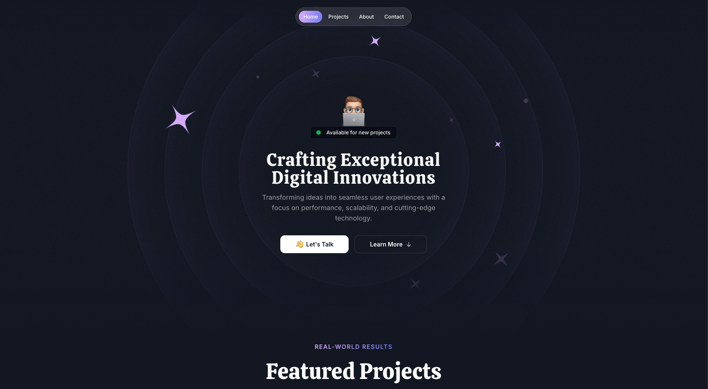
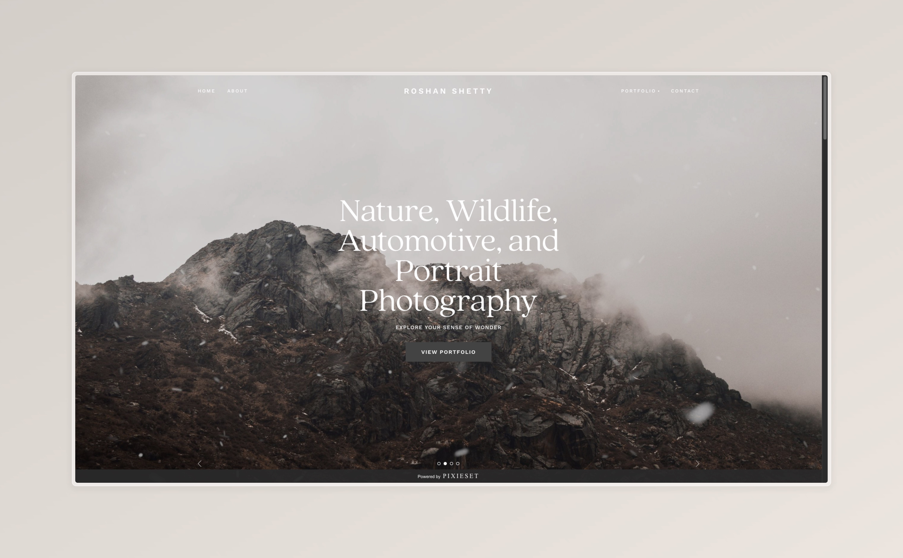

<h1 align="center">Hi, I'm Roshan Praveen Shetty</h1>

  Full-Stack Engineer | iOS Developer | Cloud Enthusiast  

  
  
  

---
## About Me  
Full-stack engineer skilled in building web and mobile apps with React and SwiftUI, and cloud backends with Firebase and Supabase. I focus on creating clean, user-friendly digital experiences. Outside coding, I enjoy photography, hiking, and anime.

---
## Featured Projects
### Web Apps  
| App | Description | Tech Stack | Links |
|-----|-------------|------------|-------|
| **RateMyDC** | Platform for sharing reviews & ratings of degree colleges, helping students make informed academic decisions. |  | [Website](https://ratemydc.com) |
| Erase It | A web application that allows users to remove backgrounds from images. |  | [Website](https://eraseit.vercel.app/) |
| AI Image Upscaler | An AI-powered web app for upscaling images to higher resolutions, making them sharper and more detailed. |  | Coming Soon |

### Mobile Apps
| App | Description | Tech Stack | Links |
|-----|-------------|------------|-------|
| **AniSync** | Anime tracker app with smooth UI built on React Native (Expo) using the AniList API. |  | [App Store](https://getanisync.vercel.app/) |
| **AniQueue** | Next-gen anime & manga tracker using SwiftUI, Firebase, and Jikan API for rich data. |  | [App Store](https://apps.apple.com/us/app/aniqueue-track-anime-manga/id6751150040) |
| **DocuSync** | Document management app crafted with SwiftUI and SwiftData for seamless offline-first syncing. |  | Coming Soon |

### Browser Extensions
| Extension | Description | Tech Stack | Links |
|-----------|-------------|-------|-------|
| **Netflix AutoSkip** | Automatically skips intros & recaps on Netflix. Over 1k users. |   | [Chrome Web Store](https://chromewebstore.google.com/detail/netflix-autoskip/ccneeceepbhmgaonnhcbhbmhfomnpnfh?authuser=0&hl=en) |
| **Spotify Playlist Shuffler** | Shuffle your Spotify playlists perfectly using this handy chrome extension. |   | [Chrome Web Store](https://chromewebstore.google.com/detail/playlist-shuffler-perfect/ijblgikblehedakbkdpbjcjabomboaep?authuser=0&hl=en) |

### UI
| App | Description | Tech Stack | Links |
|-----|-------------|------------|-------|
| **Devil Fruit Encyclopedia** | Designed ure HTML, CSS  |  | [Website](https://devilfruit.vercel.app)  |

---
## Skills & Tech Stack  
### Programming Languages  

  

### Frameworks, Libraries & Markup

  

### Tools & Platforms  

  

---
## GitHub at a Glance  

  
  

  

---
## [Portfolio](https://roshanpshetty.vercel.app/)  

  

---
## [Photography](https://roshanpshetty.mypixieset.com/)
Capturing moments and emotions through my lens.  
  

---

Thanks for stopping by! Let's create something amazing together.

