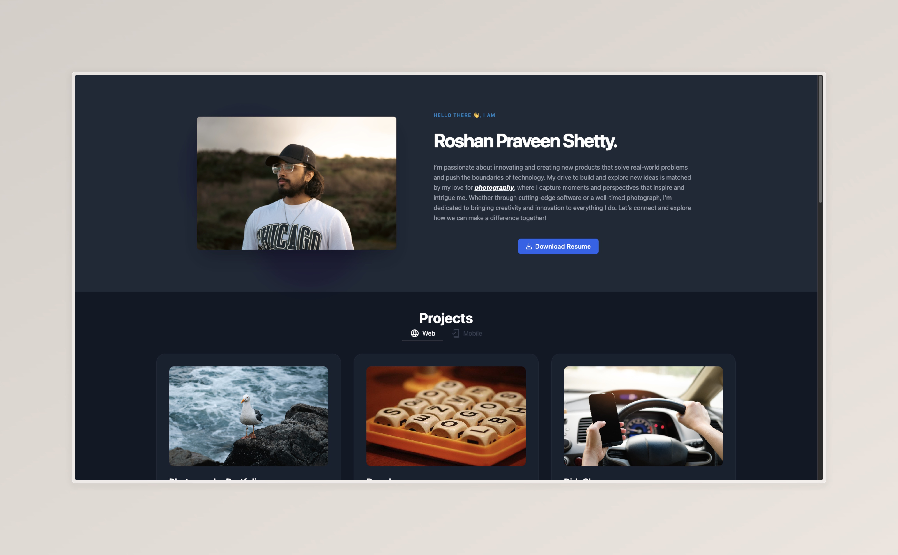

# Hi there, I'm Roshan Praveen Shetty 👋

Welcome to my GitHub profile! I'm a passionate **Full-Stack Engineer** with a love for creating innovative solutions and exploring the intersection of technology and creativity. With a strong background in software development and a keen interest in photography and anime, I bring a unique perspective to the projects I work on.

## 🚀 About Me

- 🔭 I’m currently working on [Netflix AutoSkip](https://netflix-autoskip.vercel.app/), a Chrome extension that enhances your Netflix experience.
- 🌱 I’m currently learning TypeScript, Next.js, and Svelte.
- 💬 Ask me about full-stack development, SaaS products, and automating workflows.
- 🌐 Check out my [portfolio website](https://roshanshetty.netlify.app/) and my [photography website](https://roshanshetty.mypixieset.com/).
- 🎨 I also share my art on [Instagram](https://www.instagram.com/roshandraws) and [photography](https://www.instagram.com/_shettyroshan/).

## 🌟 Personal Portfolio 

Check out some highlights from my [portfolio](https://roshanpshetty.vercel.app/):

## 🛠️ Skills & Technologies

### Programming Languages

  
  
  
  
  

### Frameworks & Libraries

  
  
  
  
  
  

### Tools & Platforms

  
  
  
  
  
  
  

## 🎨 Hobbies & Interests

### Photography 📸 
Capturing moments through my lens is a passion of mine. Each photograph is an attempt to capture the beauty and emotion of the world around us. 

Explore more of my work on my [photography portfolio](https://roshanshetty.mypixieset.com/).

### Anime 📺
I'm an avid anime enthusiast, always excited to dive into new series and discuss my favorites. Anime has a special place in my heart, and I love sharing my experiences and thoughts with others.

## 📈 GitHub Stats

## 📫 Connect with Me

  
  
  

Looking forward to connecting with like-minded individuals and contributing to impactful projects. Feel free to explore my repositories, and don't hesitate to reach out if you'd like to collaborate!

Thanks for visiting! 😄
